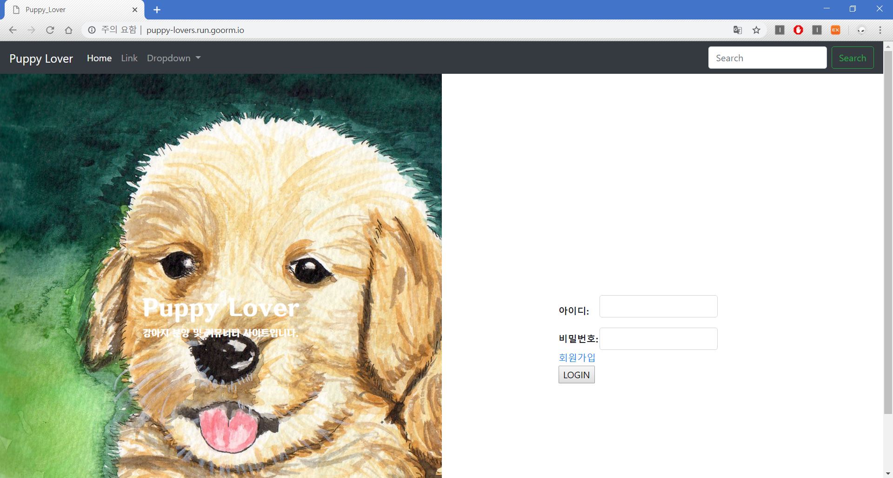

# Dependencies
* Python 3.7
* Django 2.1
    * [django-summernote](https://github.com/summernote/django-summernote)
    * [django-taggit](https://github.com/jazzband/django-taggit)
* Javascript
    * jQuery(Optional)
    
 ## puppy-lovers
 ### 구현할기능들

- 회원가입 & 로그인
- Post & Tag & 댓글
Tag는 place와 post에 적용 가능
각 Post는 추천을 받을 수 있고, 일정 추천 수가 넘으면 post를 상위로 이동
- 후기 & 평점
어떤 쇼핑몰에서 무엇을 샀으며, 어떤지 작성 가능
- Profile 등록 & 연계
입양을 원하는 사용자가 입양을 해준 사용자에게 profile 연계 받음
- 등급 or 포인터 제도 
사용자의 신뢰성을 보여주기 위한 제도
- 실시간 검색 - 어려움
실시간 사용자들의 관심 주제 파악 가능

**goormIDE**를 통해 개발

 #### Description(실제 구현 내용)
 - 강아지 커뮤니티 사이트
   - 회원가입/로그인
   - 게시판 (조회수)
   - 댓글
   - 애완용품 후기(평점)
   - 애완용품 매매 및 분양  
 #### 메인 page
  
 #### 회원가입 page
 
 
 #### Home page
 
 
 #### 소통 page
 
 
 #### 분양 page
 
 #### 후기 page
 
 
